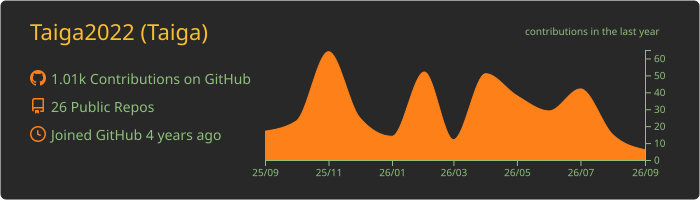
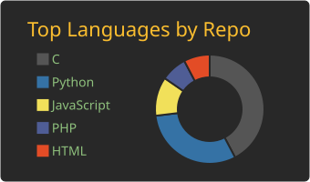
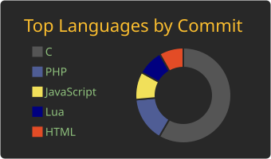
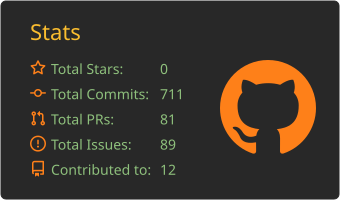
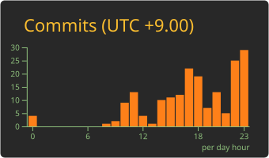

# Hi, I'm Taiga 👋

### Software Engineer

Building, learning, and improving one commit at a time.

## About me

- 🧑‍💻 Software engineer
- 🌱 Always exploring better tools and technologies
- 🛠️ Interested in building useful, maintainable products

## Tech stack

  

  

## GitHub activity

  

  
  

  
  

  Activity cards are generated daily with GitHub Actions.

